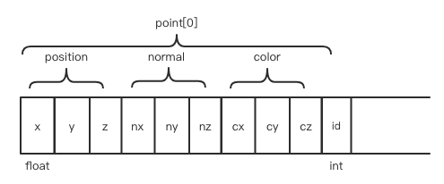
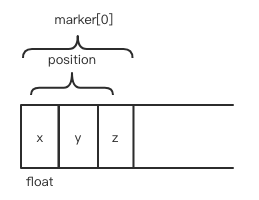
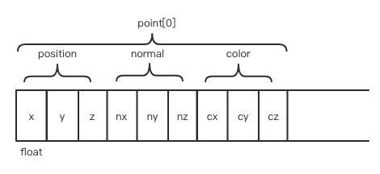
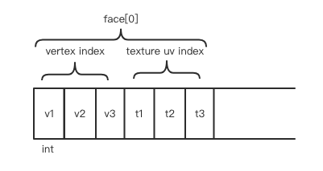
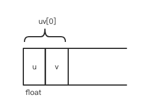
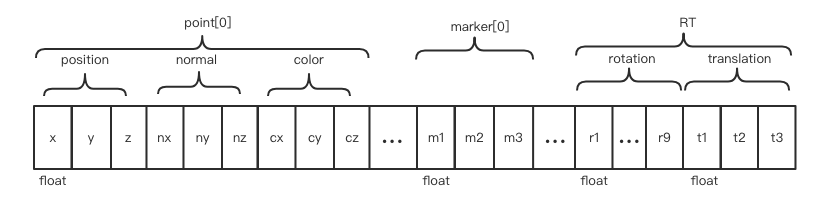

# SDK Document

| Time       | Version    | Author       | Modified contents                              |
| ---------- | ---------- | ------------ | ---------------------------------------------- |
| 2019-02-28 | v3.0 beta | Jinming Chen | Initial publish                 |
| 2019-03-05 | v3.0 beta2 | Jinming Chen | Add section of shared memory |
| 2019-03-06 | v3.0 beta3 | Jinming Chen | Add section of video data and range data |
| 2019-03-07 | v3.0 beta4 | Jinming Chen | Add new project and open project |
| 2019-03-11 | v3.0 beta5 | Jinming Chen | Add save project and start/end/cancel scanning |
| 2019-03-12 | v3.0 beta6 | Jinming Chen | Add mesh, export data and manual align |
| 2019-03-21 | v3.0 beta7 | Jinming Chen | Add enter cali & exit cali |
| 2019-04-15 | v3.1.0 Release | Weijian Lin | Add post data process |
| 2019-05-20 | v3.1.1 Release | Weijian Lin | Add incremental point cloud handle |
| 2020-09-29 | v3.2 Beta | Rui Jia | Modified for SE/SP |
| 2022-01-17 | v3.4 | Rui Jia | Add global registertion |

[TOC]


## Overview

This is the official SDK that helps third party developers to write apps to manipulate 3D cameras of Shining3D's S series.

It runs as a standalone executable and communicates with 3rd apps via ZMQ. The interfaces try to keep consistent with the latest EXScan S®, the official controlling software of S series cameras.

## Installation

The SDK consists of only two files:

- Sn3DPlatform.exe: the main executable of the SDK.
- platform.ini: the configuration file.

The executable cannot run alone. It has dependencies of the controlling software. Therefore, these two files have to be put into the root directory of EXScan S installation path, i.e. in the same directory of EXScan S .exe.

## Configuration & run

Currently there are only two parameters in platform.ini in version v1.0:

- `Pub`: the publish url of ZMQ. Default is `tcp://*:11398`.
- `Rep`: the request url of ZMQ. Default is `tcp://*:11399`.

Normally you only need to change the ports if you want.

Firstly，Double click ScanService.exe which in the same directory of EXScan S .exe. After that, Double click Sn3DPlatform.exe and then the SDK is ready to talk to you via ZMQ interfaces.

## Interfaces

Each message between Sn3DPlatform.exe and your app consists of two frames:

- Envelop: An ASCII string with a maximum length of 255. It contains two parts:
  - Version: the version of this message. Currently only `"v1.0"` is supported.
  - Commands: the actual commands of this message. The commands may have several parts, who are joined by character `/`.
- Payload: A byte array with a maximum length of 1024. It could be an integer, a string, or a JSON object, depending on the certain command.

The heartbeat message is a special message publishing from the SDK. It has only the envelop. Third party app should pay attention if they receive a message with such envelop.

There are three types of interfaces:

- **Publish**: The publish messages are published automatically by SDK when the corresponding properties are changed.
- **Request Get**: Third apps use this interface to get certain value from the device with a REQ/REP pattern.
- **Request Set**: Third apps use this interface to set certain value on the device with a REQ/REP pattern.

To receive all the publish messages, you should connect to the `Pub` url. To do Req/Rep communication to the SDK, you should connect and send/receive data to the `Rep` url.

The payload has different types:

- **Int Bool**: integar with 4 bytes, 0 means `false`, 1 measn `true;
- **Int**: signed integar with 4 bytes;
- **Int LL**: signed longlong integar with 8 bytes;
- **String**: C-style string;
- **JSON**: JSON object.

### Heartbeat

This is a publish message broadcasted by the SDK repeatedly to indicate the main SDK process is still alive.

| Type    | Envelop | Payload |
| ------- | ------- | ------- |
| Publish | v1.0/hb | None    |

The interval of heartbeat is 1 seconds currently. Third app who cares about the aliveness of SDK could moniter the heartbeat. If no heartbeat comes any more, the main SDK process should be dead and needs relaunching.

### Asynchronous actions

Many actions on the device take time to perform. To inform the third party apps the current status of the actions, the SDK broadcasts three messages/signals:

- **The beginning messages**: indicating that the action has begun.
- **The progress messages**: telling how far the action has gone. The progress value is between 0 and 100. It is ideal for developers to bind the value to a visual progress bar. Note: some actions don't have this kind of messages.
- **The finishing messages**: signaling that the action has finished.

| Type    | Envelop                | Payload |
| ------- | ---------------------- | ------- |
| Publish | v1.0/beginAsyncAction  | JSON    |
| Publish | v1.0/progress          | Int     |
| Publish | v1.0/finishAsyncAction | JSON    |

All the asynchronous actions are listed below:

- `"AAT_CHECK_DEVICE"`: Check the device.
- `"AAT_NEW_PROJECT"`: Create a new project.
- `"AAT_OPEN_PROJECT"`: Open the specified project.
- `"AAT_ENTER_SCAN"`: Enter the scanning state.
- `"AAT_EXIT_SCAN"`: Exit the scanning state.
- `"AAT_CANCEL_SCAN"`: Cancel the current scanning.
- `"AAT_END_SCAN"`: Finish the current scanning.
- `"AAT_SCAN"`: Start scanning.
- `"AAT_MESH"`: Start warping/meshing the point cloud.
- `"AAT_SAVE"`: Save the current scanned model to the project.

The beginning JSON format is below:

```js
{
    "type": "AAT_CHECK_DEVICE",
    "props": {}
}
```

The `props` differs between different actions. It will be explained in detail under the corresponding action interface later.

The finishing JSON format is below:

```js
{
    "type": "AAT_CHECK_DEVICE",
    "result":{
        "success": false,
        "error": 2,
        "detail": "Cannot connect to the device."
    },
    "props": {}
}
```

The `props` differs between different actions. It will be explained in detail under the corresponding action interface later.

### Shared memory

Messages through ZMQ are commands, signals or small data. It is not feasible to transfer large data through ZMQ since it involves redundant copying. We use shared memories to transfer large data.

There are 6 different types of large data transferring via shared memories currently:

- `"MT_POINT_CLOUD"`: Point cloud captured by the device and sent to apps.
- `"MT_DELETE_POINTS"`: Indices of points that need deleting. It is sent from apps to the device.
- `"MT_MARKERS"`: The positions information of markers captured by the device and sent to apps.
- `"MT_TRI_MESH"`: Triangle mesh information sent from the device to apps.
- `"MT_VIDEO_DATA"`: Video streaming sent from the device to apps.
- `"MT_RANGE_DATA"`: Single frame data with depth information sent from device to apps in fix mode only.

To receive shared memories, you need to do the following steps:

1. Setup a new `ZMQ_REQ` type ZMQ socket, and bind to a url.
2. Register to the SDK by calling `v1.0/scan/register` and send the url. It should be done before the scanning, otherwise data might be lost.
3. Wait for requesting from the SDK with the key and type of the shared memory.
4. Open the shared memory using language-specific manner and analyzing the data.
5. Reply the SDK with Int Bool `true` if you sucessfully handle the data, `false` otherwise.
6. Finish analyzing. Return to Step 3, waiting for the next large data.

Related interfaces are:

| Type    | Envelop              | Payload |
| ------- | -------------------- | ------- |
| Request | v1.0/scan/register   | String  |
| Request | v1.0/scan/unregister | String  |

The message sent from SDK to the app contains JSON with the information (key and type) of the shared memory. It has no envelop. The JSON definition is below:

```js
{
    "type": "MT_POINT_CLOUD",   // The data type
    "key": "qtipc_XXXXXXXXXX",  // The native shared memory key
    "name": "currentPointCloud",// The name of current data
    "offset": 100,              // The offset from the beginning of the data (bytes)
    "props":{}                  // type-specific parameters
}
```

#### Open from other languages

The key is a native mapped file descriptor on Windows. You can use corresponding functions in your favorite language to open and manipulate it. For example, in Python, the shared memory can be opend like this:

```python
import mmap
shm = mmap.mmap(0, 512, 'qtipc_XXXXXXXXXX')
```

Then you can use member functions of `mmap` to read/write the shared memory.

In C#, the same thing can be done like this:

```c#
using System.IO.MemoryMappedFiles;
MemoryMappedFile mm = MemoryMappedFile.OpenExisting(@"qtipc_XXXXXXXXXX",
                                                    MemoryMappedFileRights.ReadWrite);
using(var accessor = mm.CreateViewAccessor(0, 512)){
    // read/write using accessor
}
```

#### Properties and structures on the shared memory

Different data types have different props and structures.

##### Point cloud related data

For `MT_POINT_CLOUD`, `MT_MARKERS`, `MT_RANGE_DATA` and `MT_TRI_MESH`, the props definition is:

```js
{
    "pointCount": 1000,     // The number of points
    "hasTexture": false,    // Whether there is texture attribute for each point
    "hasNormal": true,      // Whether there is normal attribute for each point
    "incremental": true,    // Whether this data is incremental to the last data
    "hasMarkers": true,     // Whether this data contains markers
    "haveUsed": false,      // [Todo]
    "hasTexturePicture": false,// [Todo]
    "faceCount": 500,       // The number of triangles
    "textureImgWidth": 512, // The width of texture image
    "textureImgHeight": 512,// The height of texture image
    "textureUVCount": 1000, // [Todo]
    "hasFaceNormal": true,  // Whether there is normal attribute for each triangle
    "packID": 0,            // Current package index, used for data segmentation
    "totalPacks": 10        // Total package count, used for data segmentation
}
```

There are 8 different named shared memories currently:

- `"currentPointCloud"`: Current frame of point cloud.
- `"currentMarker"`: Current frame of markers.
- `"wholePointCloud"`: The whole point cloud.
- `"failedPointCloud"`: Current frame of point cloud that cannot be aligned to existing points.
- `"frameMarkerPoint"`: Global marker file information.
- `"wholeMarkerPoint"`: The whole markers information.
- `"meshData"`: The triangle mesh data.
- `"rangeData"`: One frame of point cloud data in fix mode.

For `currentPointCloud`, `failedPointCloud` and `wholePointCloud`, the structures on the shared memory starting at offset `offset` are:



If `hasNormal` is `false`, then the normal part will be missing. If `hasTexture` is false, then the color part will be missing. If `incremental` is false, the id part will be missing.

The id is integer with 4 bytes, and the others are all float with 8 bytes.

For non-incremental `wholePointCloud`(the `incremental` property is `false` of its props), the complete data may be divided into`totalPacks` packages, and `packID` denotes the current package index. Developers should gather all the packages before processing the whole data.  

For incremental `wholePointCloud`(the `incremental` property is `true` of its props), you should update point cloud data according to the value of ID. When you receive the `incremental` wholePointCloud data, you can iterate the point cloud data to get the value of IDs which are the indice of data array. If the ID is smaller then the size of the whole point cloud, it means it is an *old* point, and you should update the origin position, normal and color using received data through the new inex of id; If the ID is equal to or larger than the size of the whole point cloud, it means it is a *new* point, and you need to append this point to the whole point cloud (effectively expanding the whole point cloud).  

As mentioned above, the whole points are updated in an incremental manner while the current point cloud is updated in the same manner as the first frame. So from the 2nd frame and so on, the whole point data should be different from the current point cloud.  

These two point clouds share the same memory type of `MT_POINT_CLOUD`, however, the names of memory are different, i.e. the name for current point is `currentPointCloud` and the whole point name is `wholePointCloud`. You should distinguish them by the memory names and handle them accordingly.

For `currentMarker`, `frameMarkerPoint` and `wholeMarkerPoint`, the structures on the shared memory starting at offset `offset` are:



For `meshData`, since the data is too large, it is sent via 4 sequential units, each of which may consist of several packages (`totalPacks` is larger than 1):

**Unit 1: Vertices unit.**

If `pointCount` is non-zero, this unit delivers the vertices. The structures on the shared memory starting at offset `offset` are almost the same as point cloud except the absence of `id`:



If `hasNormal` is `false`, then the normal part will be missing. If `hasTexture` is false, then the color part will be missing. If `incremental` is false, the id part will be missing.

**Unit 2: Texture image unit.**

If `hasTexturePicture` is `true`, this unit delivers the texture image. The image has `textureImgWidth * textureImgHeight` pixels, each of which is 3 bytes of RGB.

**Unit 3: Triangles unit.**

If `faceCount` is non-zero, this unit delivers the indexed triangles.  The structures on the shared memory starting at offset `offset` are:



If `hasTexturePicture` is false, then the part of texture uv index will be absent.

**Unit 4: Texture UV unit.**

If `textureUVCount` is non-zero, this unit delivers the texture UV coordinates. The structures on the shared memory starting at offset `offset` are:



After receving the 4 units, developers can put them togather and analyze/render the triangle mesh.

For `rangeData`, the structures on the shared memory starting at offset `offset` are:



If `hasNormal` is `false`, then the normal part will be missing. If `hasTexture` is false, then the color part will be missing. If `incremental` is false, the id part will be missing.

`rotation` is a 3x3 column-major matrix, and `translation` is a 3-element vector.

##### Video data

For `MT_VIDEO_DATA`, the props definition is:

```js
{
    "width": 512,  // Image width
    "height": 512, // Image height
    "rotation": 90,// The rotation angle (in degree)
    "channel": 1   // The channel number for each pixel
}
```

If `channel` is 1, it means that it is a grey image; if `channel` is 3, it means that it is a colorful image coming from the texture camera, and each pixel contains RGB 3 bytes.

There are 4 different named shared memories currently:

- `"cam0"`: The 1st camera.
- `"cam1"`: The 2nd camera.
- `"cam2"`: The 3rd camera.
- `"cam3"`: The 4th camera.

To render the images correctly, developers should rotate the images counterclockwise with the degree of `rotation`.

### Device type

The type of your connected camera. For S Series, the device type is SE/SP.

| Type        | Envelop          | Payload               |
| ----------- | ---------------- | --------------------- |
| Publish     | v1.0/device/type | String                |
| Request Get | v1.0/device/type | REQ: None REP: String |

### Device check

Check the hardware environment to determine whether the GPU and USB are good for the camera.

| Type        | Envelop           | Payload                 |
| ----------- | ----------------- | ----------------------- |
| Request Get | v1.0/device/check | REQ: None REP: Int Bool |

The reply of request set denotes whether the action is successful.

Asynchronous signals will be emitted.

The beginning `props` is empty.

The finishing `props` has the following definition:

```js
{
    "GPU": true,// true: OK false: error
    "USB": true // true: OK false: error
}
```

There is no `progress` signal.

### PLE

Current PLE of your device.

| Type        | Envelop         | Payload               |
| ----------- | --------------- | --------------------- |
| Publish     | v1.0/device/ple | String                |
| Request Get | v1.0/device/ple | REQ: None REP: String |

### Device status

The current status of the device. There are two status currently:

- `"DS_OFFLINE"`: The device is not connected to your computer or its power is off.
- `"DS_ONLINE"`: The device is well connected.

| Type        | Envelop            | Payload               |
| ----------- | ------------------ | --------------------- |
| Publish     | v1.0/device/status | String                |
| Request Get | v1.0/device/status | REQ: None REP: String |

### Scan type

Get the current scanning type. There is  one types currently:

- `"ST_FIXED"`: Fix mode scanning.

| Type        | Envelop        | Payload               |
| ----------- | -------------- | --------------------- |
| Publish     | v1.0/scan/type | String                |
| Request Get | v1.0/scan/type | REQ: None REP: String |

### Scan sub-type

Get or set scan sub-type. Some scanning type has sub types. There are 2 different types currently:

- `"SST_FIXED_FREE"`: Free style for fix scanning.
- `"SST_FIXED_TURNABLE"`: Turnable style for fix scanning.

| Type        | Envelop               | Payload                   |
| ----------- | --------------------- | ------------------------- |
| Publish     | v1.0/scan/subType     | String                    |
| Request Get | v1.0/scan/subType     | REQ: None REP: String     |
| Request Set | v1.0/scan/subType/set | REQ: String REP: Int Bool |

The reply of request set denotes whether the action is successful.

### Has turnable

Get or set whether this fix scanning is connected to a turnable.

| Type        | Envelop                   | Payload                     |
| ----------- | ------------------------- | --------------------------- |
| Publish     | v1.0/scan/hasTurnable     | Int Bool                    |
| Request Get | v1.0/scan/hasTurnable     | REQ: None REP: Int Bool     |
| Request Set | v1.0/scan/hasTurnable/set | REQ: Int Bool REP: Int Bool |

The reply of request set denotes whether the action is successful.

### Scan with texture

Get or set whether this scanning is with texture.

| Type        | Envelop                   | Payload                     |
| ----------- | ------------------------- | --------------------------- |
| Publish     | v1.0/scan/withTexture     | Int                         |
| Request Get | v1.0/scan/withTexture     | REQ: None REP: Int          |
| Request Set | v1.0/scan/withTexture/set | REQ: Int Bool REP: Int Bool |

The reply of request set denotes whether the action is successful.

### Predefined resolution values

Get the predefined resolution values (i.e. point distances).

| Type        | Envelop                    | Payload            |
| ----------- | -------------------------- | ------------------ |
| Publish     | v1.0/scan/resolutionValues | JSON               |
| Request Get | v1.0/scan/resolutionValues | REQ:None REP: JSON |

The JSON definition is below:

```js
{
    "high": 1.0,
    "mid": 0.5,
    "low": 1.0
}
```


### Point count

Get the total point count while scanning.

| Type        | Envelop              | Payload           |
| ----------- | -------------------- | ----------------- |
| Publish     | v1.0/scan/pointCount | Int               |
| Request Get | v1.0/scan/pointCount | REQ:None REP: Int |

### Marker count

Get the count of markers while scanning.

| Type        | Envelop               | Payload           |
| ----------- | --------------------- | ----------------- |
| Publish     | v1.0/scan/markerCount | Int               |
| Request Get | v1.0/scan/markerCount | REQ:None REP: Int |

### Triangle count in fix mode

Get all the triangle count in fix mode scanning.

| Type        | Envelop                  | Payload           |
| ----------- | ------------------------ | ----------------- |
| Publish     | v1.0/scan/pointFaceCount | Int               |
| Request Get | v1.0/scan/pointFaceCount | REQ:None REP: Int |

### Triangle count of wrapped mesh

Get the total triangle count of wrapped mesh.

| Type        | Envelop                 | Payload           |
| ----------- | ----------------------- | ----------------- |
| Publish     | v1.0/scan/triangleCount | Int               |
| Request Get | v1.0/scan/triangleCount | REQ:None REP: Int |

### Frame memory

Get the speculated frame count and the memory size needed for each frame. It is emitted before the global optimization in handled rapid mode. User should make sure that current computer condition is capable to handle this.

| Type        | Envelop               | Payload            |
| ----------- | --------------------- | ------------------ |
| Publish     | v1.0/scan/frameMemory | JSON               |
| Request Get | v1.0/scan/frameMemory | REQ:None REP: JSON |

The JSON definition is below:

```js
{
    "count": 10,  // the speculated frame count
    "memory": 100 // the speculated memory size for each frame (MB)
}
```

### Scan with global markers

Whether it is using global markers for scanning.

| Type        | Envelop                | Payload                 |
| ----------- | ---------------------- | ----------------------- |
| Publish     | v1.0/scan/globalMarker | Int Bool                |
| Request Get | v1.0/scan/globalMarker | REQ: None REP: Int Bool |

### Current brightness

Get or set the current scanning brightness. The value will be changed according to different scanning types.

| Type        | Envelop                         | Payload                |
| ----------- | ------------------------------- | ---------------------- |
| Publish     | v1.0/scan/currentBrightness     | Int                    |
| Request Get | v1.0/scan/currentBrightness     | REQ: None REP: Int     |
| Request Set | v1.0/scan/currentBrightness/set | REQ: Int REP: Int Bool |

The reply of request set denotes whether the action is successful.

### Point count in wrapped mesh

Get the point count in the wrapped mesh.

| Type        | Envelop                  | Payload           |
| ----------- | ------------------------ | ----------------- |
| Publish     | v1.0/scan/meshPointCount | Int               |
| Request Get | v1.0/scan/meshPointcount | REQ:None REP: Int |

### HDR

Whether current scanning is HDR capable.

| Type        | Envelop         | Payload                |
| ----------- | --------------- | ---------------------- |
| Publish     | v1.0/scan/isHDR | Int Bool               |
| Request Get | v1.0/scan/isHDR | REQ:None REP: Int Bool |

### Scan alignment type

Get the scan alignment type. There are 8 align types currently:

- `"AT_FEATURES"`: Use features to do alignment.
- `"AT_MARKERS"`: Use markers to do alignment.
- `"AT_TURTABLE"`: Use the turnable axis to do alignment in fix mode. Note: it's TUR**T**ABLE not TUR**N**ABLE. It's a historical typo, which should be hopefully corrected in the next version.
- `"AT_CODE_POINT"`: Use special code markers to do alignment.
- `"AT_GLOBAL_POINT"`: Use global markers to do alignment.

| Type        | Envelop             | Payload              |
| ----------- | ------------------- | -------------------- |
| Publish     | v1.0/scan/alignType | String               |
| Request Get | v1.0/scan/alighType | REQ:None REP: String |

### Enter scan

Ask the SDK to enter the certain type of scan. There are 3 different scan types currently, as stated previously [Scan type](#scan-type).

| Type    | Envelop             | Payload                   |
| ------- | ------------------- | ------------------------- |
| Request | v1.0/scan/enterScan | REQ: String REP: Int Bool |

The reply of request set denotes whether the action is successful.

Asynchronous signals will be emitted.

The beginning `props` and finishing `props`  are both empty, and there is no `progress` signal.

### Exit scan

Ask the SDK to exit from current scanning.

| Type    | Envelop            | Payload                 |
| ------- | ------------------ | ----------------------- |
| Request | v1.0/scan/exitScan | REQ: None REP: Int Bool |

The reply of request set denotes whether the action is successful.

Asynchronous signals will be emitted.

The beginning `props` and finishing `props`  are both empty, and there is no `progress` signal.

### Create new project

Create new project with necessary parameters.

| Type        | Envelop              | Payload                 |
| ----------- | -------------------- | ----------------------- |
| Request Get | v1.0/scan/newProject | REQ: JSON REP: Int Bool |

The reply of request set denotes whether the action is successful.

The request JSON definition is below:

```js
{
    "path": "c:/a",               // Where to create the project
    "globalMarkerFile": "c:/b.p3",// The absolute global marker file path if used
    "textureEnabled": false,      // Whether texture is enabled
    "pointDist": 0.5,             // The point distance/definition
    "alignType": "AT_FEATURES",   // The alignment type
    "rapidMode": false,           // Whether it's EP rapid mode
    "fastSave": false             // Whether it's EP fast save mode
}
```

Note: 1.the project can only be created **after** entering a certain type of scanning. So developers should call entering scan before calling this interface. 2. About the markers data, you should create the project with scan align type `MT_FEATURE`. The marker data will change after pressing the button named refresh when you set the project type as `MT_MARKER`.

Asynchronous signals will be emitted.

The beginning `props` and finishing `props`  are both empty, and there is no `progress` signal.

### Open project

Open an existing project.

| Type        | Envelop               | Payload                   |
| ----------- | --------------------- | ------------------------- |
| Request Get | v1.0/scan/openProject | REQ: String REP: Int Bool |

The request payload is the absolute path of the project. The reply of request set denotes whether the action is successful.

Asynchronous signals will be emitted.

The beginning `props` is empty.

The finish `props`'s definition is:

```js
{
    "pointCount": 1000,// The point count of the model
    "hasTexture": true // Whether this project contains texture
}
```

There is no `progress` signal.

### Control scanning (start/pause)

Ask the SDK to start/pause scanning with specified parameters.

| Type    | Envelop             | Payload                 |
| ------- | ------------------- | ----------------------- |
| Request | v1.0/scan/control | REQ: JSON REP: Int Bool |

The reply of request set denotes whether the action is successful.

The JSON definition is:

```js
{
    "action": "pre",                    // Action type
    "params":{
        "enableHDR": false,             // Whether HDR should be enabled
        "alignType": "AT_FEATURES",     // The alignment type
        "subScanType": "SST_FIXED_FREE",// Sub scan type
        "turntableTimes": 10            // The turn times in fix mode
        "turntableSpeeds": 10          // The turn speed in fix mode
        "turntableNum": 1            // 1:turn a circle, 0.5:turn a half circle
    }
}
```

The `params` is only necessary when the scanning type is fix mode, otherwise it can be left empty.

There are 2 different actions currently:

- `"start"`: start or resume the real scanning.
- `"pause"`: pause the scanning.

For fix mode scanning, `"pause"` is only available when it contains turnable.

The `alignType` can be referred to [Scan alignment type](#scan-alignment-type), and `subScanType` can be referred to [Scan sub-type](#scan-sub-type).

Asynchronous signals will be emitted. The async action type is `"AAT_SCAN"`.

Both the beginning and finishing `props`'s definitions are:

```js
{
    "fixScan": true,// Whether it is fix mode
    "status": "SS_PRE_SCAN"// Current scanning state
}
```

There is no `progress` signal.

The `status` means the current scanning status on the device before the async action actually performs.

### End scanning

Ask the SDK to end current scanning.

| Type    | Envelop           | Payload                 |
| ------- | ----------------- | ----------------------- |
| Request | v1.0/scan/endScan | REQ: JSON REP: Int Bool |

The reply of request set denotes whether the action is successful.

The JSON definition is:

```js
{
    "globalOptimize": true,// Whether perform global optimize
    "pointDist": 0.5,// Point distance
    "rebuildData": false// Whether rebuild is required [Todo] Need more explanation.
}
```

Asynchronous signals will be emitted. The async action type is `"AAT_SCAN"`.

Both the beginning and finishing `props`'s are empty, and there is no `progress` signal.

### Global Registertion

Ask the SDK to globalRegistertion.

| Type    | Envelop                      | Payload                 |
| ------- | ---------------------------- | ----------------------- |
| Request | v1.0/scan/globalRegistertion | REQ: None REP: Int Bool |

The reply of request set denotes whether the action is successful.

Asynchronous signals will be emitted. The async action type is `"AAT_ENDSCANFIXED"`.

Both the beginning and finishing `props`'s are empty, and there is no `progress` signal.

### Cancel scanning

Ask the SDK to cancel current scanning.

| Type    | Envelop              | Payload                 |
| ------- | -------------------- | ----------------------- |
| Request | v1.0/scan/cancelScan | REQ: JSON REP: Int Bool |

The reply of request set denotes whether the action is successful.

The JSON definition is:

```js
{
    "dataNames": ["wholePointCloud"]// Shared memory names which need clearing
}
```

Asynchronous signals will be emitted. The async action type is `"AAT_SCAN"`.

The beginning `props` is empty, and the finish `props` is:

```js
{
    "turntableScanCancel": false// [Todo] Need explanation
}
```

There is no `progress` signal.


### Last mesh type

Get the mesh type of last wrapping operation. There are 2 different mesh types currently:

- `"MT_NON_WATERTIGHT"`: Non watertight mesh, it means the algorithm won't try to fill very large holes while wrapping and the model will remain open.
- `"MT_WATERTIGHT"`: Watertight mesh, means it algorithm will try to fill every hole while wrapping.

| Type        | Envelop                | Payload               |
| ----------- | ---------------------- | --------------------- |
| Publish     | v1.0/scan/lastMeshType | String                |
| Request Get | v1.0/scan/lastMeshType | REQ: None REP: String |

### Mesh/Wrap the point cloud

Ask the SDK to mesh/wrap the current point cloud.

| Type    | Envelop        | Payload                 |
| ------- | -------------- | ----------------------- |
| Request | v1.0/scan/mesh | REQ: JSON REP: Int Bool |

The JSON definition is:

```js
{
    "type": "MT_NON_WATERTIGHT",// The mesh type required
    "resolution": "mid"         // The resolution for the mesh
}
```

There are 2 different mesh type currently, please refer to [Last mesh type](#last-mesh-type). And there are 3 different resolutions currently, please refer to [Predefined resolution values](#predefined-resolution-values).

Asynchronous signals will be emitted. The async action type is `"AAT_MESH"`.

The beginning `props` and finish `props` are both empty

There is `progress` signal, so developers can connect to the signal to get the process state.


### Save mesh to disk

Ask the SDK save/export corresponding formats to the disk.

| Type    | Envelop        | Payload                 |
| ------- | -------------- | ----------------------- |
| Request | v1.0/scan/save | REQ: JSON REP: Int Bool |

The reply of request set denotes whether the action is successful.

The JSON definition is below:

```js
{
    "path": "C:/abc",  // The directory where the exported files are stored
    "resizeRatio": 0.1,// The resize ratio
    "p3": true,        // Whether p3 format is exported
    "asc": true,       // Whether asc format is exported
    "stl": true,       // Whether stl format is exported
    "obj": true,       // Whether obj format is exported
    "ply": true,       // Whether ply format is exported
    "3mf": true,       // Whether 3mf format is exported
}
```

Asynchronous signals will be emitted. The async action type is `"AAT_SAVE"`.

The beginning `props` and finish `props` are both empty, and there is no `progress` signal.

